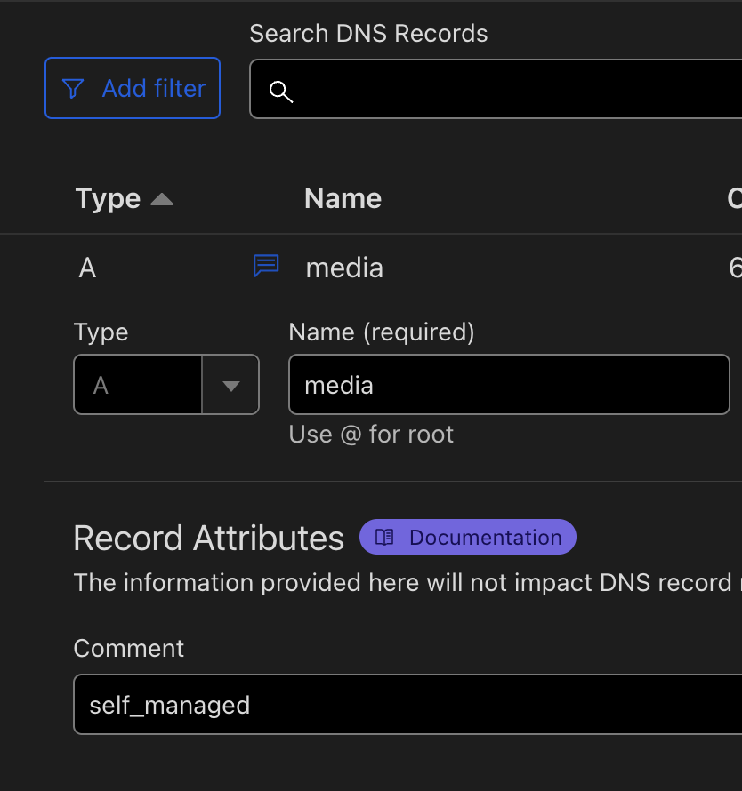
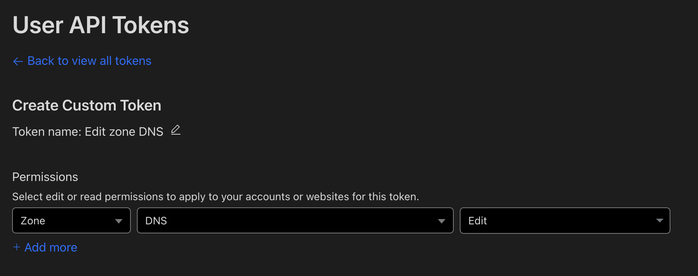

# Cloudflare IP Updater

## Overview
The Cloudflare IP Updater is a Go-based application that updates Cloudflare DNS A records whenever your public IP address changes. This ensures that your domain always points to your current IP address. The updater runs as a background process, checking your IP address every 2 minutes.  

#### _TL;DR: Open home server to internet without static ip_

## Features
- Periodically checks your public IP address.
- Updates Cloudflare DNS A records if the IP address has changed.
- Runs as a lightweight service.
- Can be deployed using Docker.

## Prerequisites
- Go 1.21.4 or later (for building from source).
- Docker (for containerized deployment).
- Cloudflare account with API key and appropriate permissions.

## Adding `{filter}` in Comment of DNS Record

To ensure the application can identify and update the correct Cloudflare DNS A records, include the `{filter}` value in the comment of each DNS record you want to be updated. Follow these steps:

1. **Log in to your Cloudflare account.**

2. **Navigate to the DNS settings** of your domain.

3. **Locate the A records** you want the application to update.

4. **Edit the A records**:
   - Click on the edit button next to the A record.
   - Add the `{filter}` value in the comment section of the DNS record. For example, if your filter value is `self_managed`, your comment should include `self_managed`.
   - 

5. **Save the changes** to the DNS records.

By adding the `{filter}` value to the comments of the DNS records, the application can accurately identify which records to update based on the filter you provide when running the application.

## Generating Access Keys from Cloudflare

To use the Cloudflare IP Updater, you need to generate an API token with the necessary permissions. Follow these steps to create an API token:

1. **Log in to your Cloudflare account.**

2. **Go to the API Tokens page**:
   - Click on your profile icon in the top right corner.
   - Select **My Profile** from the dropdown menu.
   - Navigate to the **API Tokens** tab.

3. **Create a new API token**:
   - Click on **Create Token**.

4. **Configure the API token**:
   - Under **Custom Token**, click on **Get started**.

5. **Set up permissions**:
   - **Zone Resources**:
      - Zone: Include `All Zones` or `Specific Zone` based on your requirement.
      - DNS: Select `Edit` permission.
   - 

6. **Specify the zone resources**:
   - Choose **All Zones** if you want the token to have access to all your zones.
   - Otherwise, select **Specific Zone** and specify the zone you want to manage.

7. **Complete the setup**:
   - Give your token a descriptive name.
   - Optionally, set an expiration date for the token.

8. **Create and save the token**:
   - Click on **Continue to summary**.
   - Review the token settings.
   - Click on **Create Token**.
   - Copy the generated API token and store it securely. You will need this token to authenticate the Cloudflare IP Updater.

By following these steps, you will have a Cloudflare API token with the necessary permissions to update DNS records. Use this token as the `auth_key` when running the Cloudflare IP Updater.

## Getting the Zone Identifier from Cloudflare

The Zone Identifier (Zone ID) is a unique identifier for your domain in Cloudflare. You need this ID to configure the Cloudflare IP Updater. Follow these steps to obtain the Zone Identifier:

1. **Log in to your Cloudflare account.**

2. **Select the domain** for which you need the Zone Identifier:
   - From the Cloudflare dashboard, click on the domain name in the list of your sites.

3. **Find the Zone Identifier**:
   - Once you are on the Overview page for your domain, scroll down to the **API** section on the right-hand side.
   - Here, you will see the **Zone ID**.

4. **Copy the Zone Identifier**:
   - Click on the **Copy** button next to the Zone ID to copy it to your clipboard.

You will use this Zone Identifier as the `zone_identifier` parameter when running the Cloudflare IP Updater.

## Installation

### Build from Source
1. Clone the repository:
   ```sh
   git clone https://github.com/your-repo/cloudflare-ip-updater.git
   cd cloudflare-ip-updater
   ```

2. Build the application:
   ```sh
   go build -o cloudflare-ip-updater
   ```

3. Run the application:
   ```sh
   ./cloudflare-ip-updater -zone_identifier your_zone_id -auth_key your_auth_key -filter your_filter
   ```

### Using Docker

#### Build Docker Image
1. Clone the repository:
   ```sh
   git clone https://github.com/your-repo/cloudflare-ip-updater.git
   cd cloudflare-ip-updater
   ```

2. Build the Docker image:
   ```sh
   docker build -t cloudflare-ip-updater:latest .
   ```

3. Run the Docker container:
   ```sh
   docker run -d --name cloudflare-ip-updater \
     cloudflare-ip-updater:latest \
     -zone_identifier your_zone_id -auth_key your_auth_key -filter your_filter
   ```

#### Using Docker Compose
1. Clone the repository:
   ```sh
   git clone https://github.com/your-repo/cloudflare-ip-updater.git
   cd cloudflare-ip-updater
   ```

2. Create a `.env` file with your configuration:
   ```env
   ZONE_IDENTIFIER=your_zone_id
   AUTH_KEY=your_auth_key
   FILTER=your_filter
   ```

3. Run the application using Docker Compose:
   ```sh
   docker-compose up -d
   ```

## Usage

### Command Line Arguments
- `-zone_identifier`: Cloudflare Zone Identifier (required)
- `-filter`: Cloudflare A record filter (required)
- `-auth_key`: Cloudflare Authentication Key (required)

### Example
```sh
./cloudflare-ip-updater -zone_identifier your_zone_id -auth_key your_auth_key -filter your_filter
```

### Docker Example
```sh
docker run -d --name cloudflare-ip-updater \
  cloudflare-ip-updater:latest \
  -zone_identifier your_zone_id -auth_key your_auth_key -filter your_filter
```

### Docker Compose Example
Create a `.env` file with your configuration values. Then, run:
```sh
docker-compose up -d
```

## Implementation Details

### Main Program Flow
1. The application reads the required flags (`zone_identifier`, `filter`, and `auth_key`).
2. It validates the presence of required flags.
3. It initializes a `CloudflareService` instance.
4. A Goroutine checks the current IP address every 2 minutes.
5. If the IP address has changed, it updates the Cloudflare DNS A records.

### Functions
- `main()`: The entry point of the application.
- `checkRequiredFlags()`: Validates the presence of required flags.

## Contributing
Feel free to submit issues, fork the repository, and send pull requests.

## License
This project is licensed under the MIT License. See the `LICENSE` file for details.
